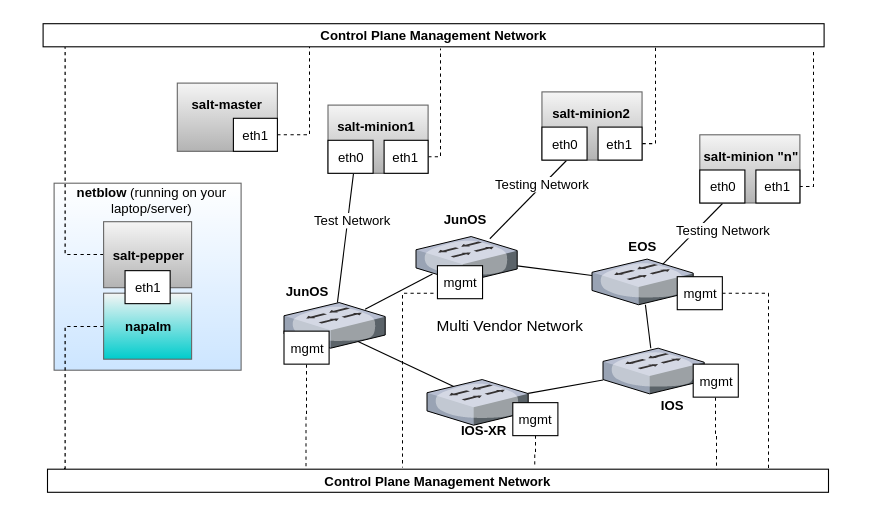

Introduction
============

netblow is a vendor agnostic network testing framework to stress network failures.

Why?
----

- You want to stress network failures to validate if the network control plane is converging as expected.
- Maybe you've just got a bleeding-edge control plane software update that hasn't been extensively tested yet :)
- You'd like to make sure that control plane changes are first validated in a CI/CD testing environment for a couple of hours or even days, before pushing to production.

Features
--------

- netblow exposes functions to stress the control plane and network failures, such as `interfaces_down`, `interfaces_up`, `interfaces_flap`, `reboot`, and `config_rollback`.
- These functions have a common set of arguments, which simplifies the business logic of your tests.
- You can either write your tests directly in Python or in a yml file.
- Tests can be run either asynchronously or synchronously in multiple devices.
- Devices re-connections are handled automatically.
- Data plane validation with salt minions (next release).
- Memory leak detection (next release).

Architecture
------------

A general idea of how netblow is designed to perform network failures stress tests in the control plane is illustrated below.

In order to have both control of the control plane, and also to perform validation in the data/forwarding plane, netblow leverages both napalm and salt-pepper. In summary, these are the main components that compose the entire software stack:

- **netblow**: Testing framework that exposes network failures functions on top of napalm and facilitates the business logic of control plane tests.

  - **napalm**: Enables netblow to manage networking devices in an agnostic manner.

  - **salt-pepper**: Lightweight HTTP client API to interface with salt-master and salt-minions remotely to perform validation of the data/forwarding plane. As a result, this allows netblow to orchestrate tests in the data plane in conjunction with the control plane tests, which is more end-to-end oriented.

- **salt-master**: Responsible for managing minions.
- **salt-minions**: Responsible for actually running the forwarding plane tests between other minions in the topology, which is up to you to define. For example, you could simply run ping, fping, nuttcp, iperf3, or use any other testing tool, as long as it's available in the minions.

.. note::

    You don't necessarily have to have salt-master and salt-minions running somewhere, they are just needed if you really need.
